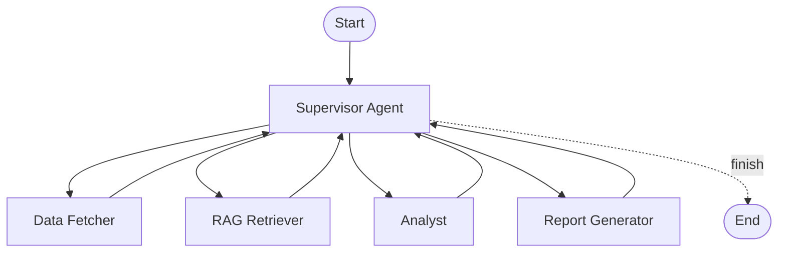

# satellite-data-agent

Agentic workflow untuk analisis data satelit dan IoT telemetry. Proyek ini memakai LangGraph sebagai orchestration layer:

- Supervisor Agent: memilih sub-agent berikutnya dan mengatur alur kerja.
- Data Fetcher: mengambil data dari file lokal atau API.
- Analyst: meringkas kondisi, mendeteksi pola, dan menandai anomali.
- Report Generator: membuat laporan Markdown yang siap dikonversi ke PDF.

Use case utama dibuat relevan dengan PSN: monitoring kualitas link satelit, gateway, remote terminal, dan telemetry perangkat IoT di area operasional.

## Architecture



LangGraph juga bisa merender diagram state graph langsung dari kode:

```bash
python scripts/render_graph.py
```

Output default:

- `docs/langgraph_state_graph.png`
- `docs/langgraph_state_graph.mmd`

Catatan: render PNG LangGraph memakai Mermaid renderer. Jika lingkungan lokal tidak bisa menjangkau renderer eksternal, file `.mmd` tetap dibuat dan bisa ditempel ke Mermaid Live Editor atau dirender dengan tool lokal.

## Data Source

Dataset demo di `data/sample_telemetry.csv` adalah data sintetis, bukan data produksi PSN. Kolom dan nilainya dibuat menyerupai telemetry operasional satelit/IoT: site, device, latency, packet loss, SNR, RSSI, throughput, dan status terminal.

Untuk penggunaan nyata, ganti file ini dengan export CSV/JSON dari NMS/NOC, IoT gateway logs, atau API telemetry internal.

## Quickstart

Buat environment Conda khusus project:

```powershell
conda create -n sat-agent python=3.11 -y
conda activate sat-agent
```

Install dependencies:

```powershell
pip install -r requirements-dev.txt
pip install -e .
```

Jalankan workflow dengan sample telemetry via CLI:

```powershell
python -m satellite_data_agent "Analyze recent telemetry data."
```

Atau jalankan UI interaktif Streamlit:

```powershell
streamlit run app.py
```

Untuk RAG pipeline (index data manual ke ChromaDB):

```powershell
python -m satellite_data_agent.rag.indexer
```

Render LangGraph diagram:

```powershell
python scripts/render_graph.py
```

Secara default proyek memakai mode deterministik tanpa LLM eksternal, jadi demo bisa jalan tanpa API key. Untuk memakai provider gratis seperti Groq atau OpenRouter, salin `.env.example` ke `.env`, lalu isi salah satu konfigurasi provider.

## Local Fallback

Jika Python aktif tidak membaca user-site packages, install dependency ke folder lokal:

```powershell
python -m pip install --target .deps -r requirements.txt
$env:PYTHONPATH=".deps;src"
```

## LangSmith Trace

Ikhsan bisa mengaktifkan tracing LangSmith dengan env var berikut:

```bash
LANGSMITH_TRACING=true
LANGSMITH_API_KEY=isi_api_key_langsmith
LANGSMITH_PROJECT=satellite-data-agent
```

Setelah menjalankan demo, tempel link trace LangSmith di sini:

> Example trace: `https://smith.langchain.com/o/.../projects/p/.../r/...`

Trace yang ideal untuk README memperlihatkan urutan:

1. Supervisor menerima request analisis telemetry.
2. Data Fetcher membaca file/API dan mengembalikan jumlah record.
3. Analyst mendeteksi tren latency, packet loss, RSSI/SNR, dan status device.
4. Report Generator membuat executive summary dan rekomendasi operasional.

## Provider Options

Prioritas yang disarankan:

- Groq: cepat dan cocok untuk demo interaktif.
- OpenRouter: fleksibel untuk mencoba banyak model gratis/low-cost.
- Mock mode: stabil untuk tes, CI, dan demo offline.

Konfigurasi tersedia di `.env.example`.

## Project Layout

```text
satellite-data-agent/
  app.py                    Streamlit UI
  data/                     Sample telemetry, KB docs, ChromaDB
  docs/                     Output diagram LangGraph
  reports/                  Output laporan demo
  scripts/                  Utility scripts
  src/satellite_data_agent/ LangGraph app, agents, tools, rag
  tests/                    Smoke tests & unit tests
```

## Next Improvements

- Tambahkan connector API untuk sumber telemetry nyata.
- Export laporan ke PDF memakai Pandoc atau WeasyPrint.
- Tambahkan threshold per site atau per device class.
- Tambahkan map-based context untuk lokasi remote terminal.
- Simpan run history ke SQLite/Postgres supaya analisis antarperiode bisa dibandingkan.
