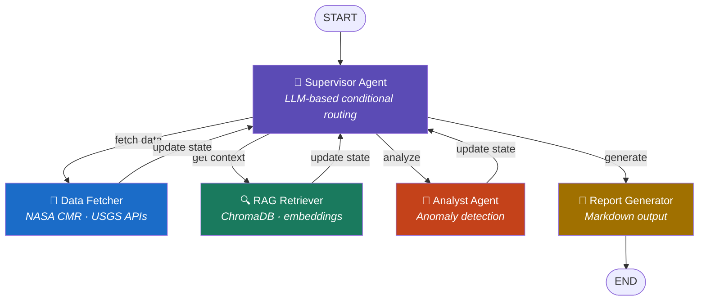

# 🛰️ satellite-data-agent

<p align="center">
  
  
  
  
  
  
  
</p>

<p align="center">
  <b>Multi-agent GenAI pipeline for automated satellite data analysis</b><br/>
  Built with LangGraph cyclic graph · RAG + ChromaDB · LangSmith observability
</p>

---

## Overview

`satellite-data-agent` is an end-to-end multi-agent system that autonomously processes satellite data, retrieves relevant technical documentation, detects anomalies, and generates structured incident reports — without manual intervention at each step.

The system uses **LangGraph's cyclic graph pattern**: a Supervisor agent continuously evaluates the current state and routes to the appropriate worker agent, enabling adaptive decision-making rather than a fixed sequential pipeline.

```
Query → Supervisor → [Data Fetcher | RAG Retriever | Analyst] → Report Generator
              ↑________________ (agents report back) _______________|
```

**Why this matters for production systems:** The cyclic architecture allows the Supervisor to call the RAG Retriever *after* fetching data (not before), based on whether the fetched data contains unfamiliar anomaly patterns — something a hardcoded pipeline cannot do.

---

## Architecture

### Agent Graph



### Shared State (AgentState)

All agents read from and write to a single shared `AgentState`. The key design decision is using `Annotated[List[str], operator.add]` for `agent_history` — each agent **appends** its log rather than replacing the previous state.

```python
class AgentState(TypedDict):
    query:           str
    agent_history:   Annotated[List[str], operator.add]  # accumulates, never replaced
    fetched_data:    Optional[dict]      # populated by Data Fetcher
    rag_context:     Optional[str]       # populated by RAG Retriever
    analysis_result: Optional[dict]      # populated by Analyst
    final_report:    Optional[str]       # populated by Report Generator
    next_action:     str                 # Supervisor's routing decision
    iteration_count: int                 # safety: prevents infinite loops
```

### LangSmith Trace

> *(Screenshot akan ditambahkan setelah deployment)*

Every node execution is automatically traced via LangSmith, providing:
- Per-node latency breakdown
- Token usage per LLM call
- Full input/output for each agent step
- Evaluation metrics for retrieval quality

---

## Key Features

**Adaptive routing** — Supervisor uses structured LLM output to decide which agent runs next based on the current state. The graph is not hardcoded; it responds to what has been collected so far.

**RAG with domain knowledge** — ChromaDB indexes satellite operations documentation (USGS Landsat Handbook, ESA Sentinel technical guides). The RAG Retriever provides this context when the Analyst encounters unfamiliar patterns.

**Real satellite data** — Connects to NASA Common Metadata Repository (CMR) API — public endpoint, no authentication required — to fetch recent granule data for any bounding box. Default: Indonesian archipelago region.

**Structured anomaly reports** — Output is a validated Pydantic model rendered as Markdown, not raw LLM text. Fields include scene description, anomaly list, confidence score, and recommended follow-up actions.

**Full observability** — LangSmith integration is zero-config: set `LANGCHAIN_TRACING_V2=true` and every node, chain, and retrieval call is automatically captured.

---

## Tech Stack

| Layer | Technology | Role |
|---|---|---|
| Agent Orchestration | LangGraph 0.2.x | Cyclic multi-agent state graph |
| LLM Framework | LangChain LCEL | Chain composition, prompt management |
| LLM Provider | OpenRouter (GPT-4o-mini) | Inference + structured output |
| Vector Database | ChromaDB | Local persistent embeddings store |
| Embedding Model | `all-MiniLM-L6-v2` | Sentence Transformers, runs locally |
| Observability | LangSmith | Distributed tracing, evaluation |
| Satellite Data | NASA CMR API | Public granule data, no API key needed |
| UI | Streamlit | Interactive demo interface |
| Persistence | LangGraph MemorySaver | Session checkpointing |

---

## Project Structure

```
satellite-data-agent/
├── src/
│   ├── state.py              # AgentState TypedDict definition
│   ├── graph.py              # LangGraph workflow + conditional routing
│   ├── agents/
│   │   ├── supervisor.py     # LLM-based routing with structured output
│   │   ├── data_fetcher.py   # NASA CMR API integration
│   │   ├── rag_retriever.py  # ChromaDB semantic search
│   │   ├── analyst.py        # Anomaly detection + insight extraction
│   │   └── report_gen.py     # Structured Markdown report generation
│   ├── tools/
│   │   └── nasa_api.py       # NASA CMR API wrapper
│   └── rag/
│       ├── indexer.py        # Document ingestion + ChromaDB indexing
│       └── retriever.py      # RAG chain with LangChain LCEL
├── data/
│   ├── telemetry/            # Simulated satellite telemetry (JSON)
│   └── knowledge_base/       # PDF documents for RAG indexing
├── tests/
│   ├── test_state.py
│   ├── test_graph.py
│   └── test_agents.py
├── app.py                    # Streamlit UI
├── requirements.txt
└── .env.example
```

---

## Installation

```bash
git clone https://github.com/YOUR_USERNAME/satellite-data-agent.git
cd satellite-data-agent
python -m venv venv && source venv/bin/activate
pip install -r requirements.txt
cp .env.example .env
```

Required environment variables (`.env`):

```bash
OPENROUTER_API_KEY=your_key_here         # https://openrouter.ai (free tier available)
LANGCHAIN_TRACING_V2=true                # enable LangSmith tracing
LANGCHAIN_API_KEY=your_langsmith_key     # https://smith.langchain.com (free)
LANGCHAIN_PROJECT=satellite-data-agent
```

Build the RAG knowledge base (run once):

```bash
python -m src.rag.indexer
```

---

## Usage

**CLI:**

```bash
python -m src.graph "Analyze recent satellite coverage anomalies over Kalimantan"
```

**Streamlit UI:**

```bash
streamlit run app.py
```

**Python API:**

```python
from src.graph import graph

result = graph.invoke(
    {"query": "Detect signal anomalies in Eastern Indonesia region, last 7 days"},
    config={"configurable": {"thread_id": "session-001"}}
)

print(result["final_report"])
```

**Example output:**

```markdown
## Satellite Analysis Report
**Date range:** 2026-06-05 to 2026-06-12
**Region:** Eastern Indonesia (bounding box: 115°E–141°E, 11°S–2°N)

### Findings
- Retrieved 8 MODIS Terra granules (MOD09GA)
- **Anomaly detected:** Unusual cloud coverage pattern over Sulawesi Tengah
  - Coverage estimate: >60% in 3 consecutive acquisitions
  - Confidence: medium (limited by single-sensor data)

### Recommended Follow-up
Cross-validate with Sentinel-2 acquisition for same period.
Check BMKG precipitation records for correlation.

### Limitations
Analysis based on visual inspection via LLM — not a validated scientific measurement.
```

---

## Design Decisions

**Why LangGraph over plain LangChain?**
LangGraph enables true cyclic execution. The Supervisor can call Data Fetcher, evaluate the result, decide RAG context is needed, call RAG Retriever, then route to Analyst — all dynamically based on state. A sequential LangChain chain cannot do this without hardcoding every branch.

**Why cyclic graph, not pipeline?**
In a fixed pipeline, RAG always runs regardless of whether context is needed. The cyclic pattern lets the Supervisor skip unnecessary steps, reducing token cost and latency for simple queries.

**Why `operator.add` on `agent_history`?**
LangGraph merges state updates from each node. Without `operator.add`, each agent would overwrite the previous agent's log. The annotation tells LangGraph to accumulate lists rather than replace them — a subtle but critical correctness detail.

**Why ChromaDB over Pinecone?**
Local persistence, zero cost, no external dependency. For a portfolio project that needs to be reproducible by anyone, this matters. The abstraction via LangChain's vector store interface means swapping to Pinecone in production requires one line change.

---

## Roadmap

- [x] Architecture design + state schema
- [x] Supervisor routing with structured output
- [x] NASA CMR API integration
- [x] ChromaDB RAG pipeline
- [x] Analyst agent with Pydantic output validation
- [x] Report generator with Markdown rendering
- [ ] LangSmith trace integration + screenshots
- [x] Streamlit UI
- [x] Unit tests (pytest)
- [ ] Docker containerization
- [ ] Integration with [`vlm-satellite-image-analyzer`](../vlm-satellite-image-analyzer)

---

## Related Project

This agent is designed to optionally integrate with **[vlm-satellite-image-analyzer](../vlm-satellite-image-analyzer)** — a VLM-based pipeline that analyzes optical satellite imagery using Gemini 1.5 Flash. When an image path is available in `AgentState`, a VLM node can be added to the graph for visual anomaly detection alongside the data-driven analysis.

---

## Author

Built as part of an AI engineering portfolio demonstrating:
LangGraph multi-agent orchestration · RAG pipeline architecture · LLM observability · Satellite domain integration

---

<p align="center">
  <sub>Data sources: NASA CMR API (public) · USGS EarthExplorer · ESA Copernicus (public)</sub><br/>
  <sub>All data sources are free and publicly accessible — no proprietary data used</sub>
</p>
